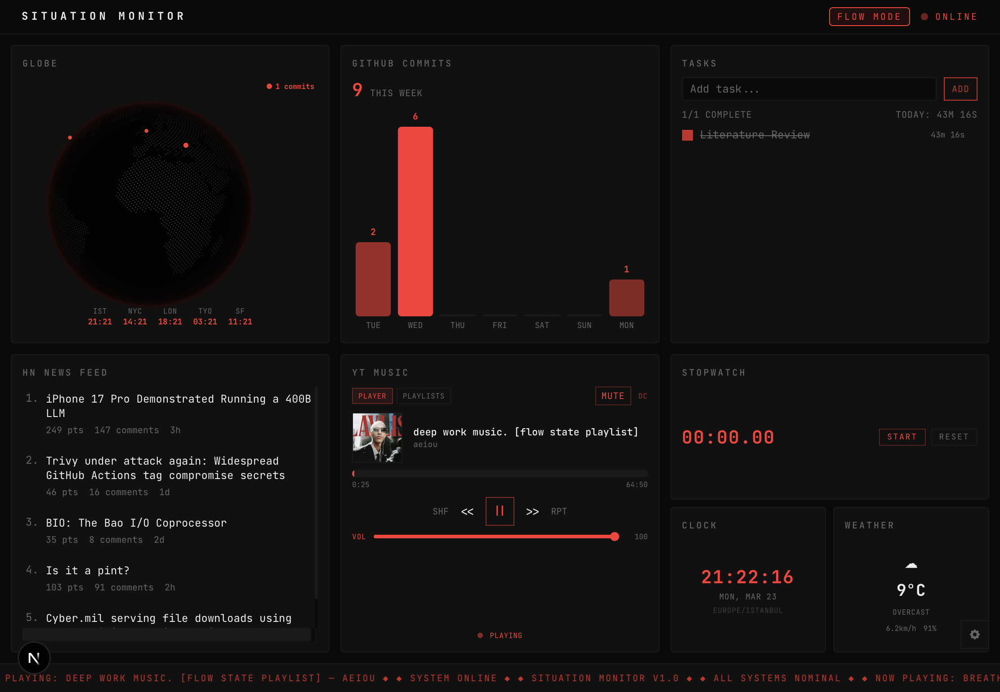

# Situation Monitor

A dark, terminal-aesthetic personal dashboard for tracking productivity. Inspired by command-center style interfaces — grid-based, monospace, green-on-black.

Built with Next.js 16, Tailwind CSS v4, and TypeScript. All data lives in localStorage — no database, no accounts, runs entirely on your machine.



## Widgets

| Widget | Description |
|--------|-------------|
| **Globe** | 3D globe with commit pulse markers + world clocks (IST, NYC, LON, TYO, SF) |
| **GitHub Commits** | 7-day commit activity chart pulled from GitHub Events API |
| **Tasks** | Todo list with per-task time tracking |
| **HN Feed** | Top 5 Hacker News stories, auto-refreshes every 15 min |
| **Spotify** | Now playing, playback controls, playlist browser (requires Spotify auth) |
| **Clock** | Live clock, ticks every second |
| **Efficiency Score** | 0–100 score combining pomodoro sessions + commits + completed todos |
| **Weather** | Current conditions via Open-Meteo (no API key needed) |
| **Pomodoro** | 25/5 work-break timer with session history |
| **Status Ticker** | Scrolling ticker bar for cross-widget notifications |

The dashboard layout is customizable — click the gear icon (bottom-right) to add, remove, or reorder widgets via drag-and-drop.

## Getting Started

### Prerequisites

- Node.js 18+
- npm (or pnpm/yarn/bun)

### Setup

1. Clone the repo:

```bash
git clone https://github.com/<your-username>/progress-bar.git
cd progress-bar
```

2. Install dependencies:

```bash
npm install
```

3. Create your environment file:

```bash
cp .env.example .env.local
```

4. Fill in `.env.local` with your values (see [Configuration](#configuration) below).

5. Start the dev server:

```bash
npm run dev
```

6. Open [http://localhost:3000](http://localhost:3000).

## Configuration

All configuration is done through `.env.local`. Every variable is optional — the dashboard works without any of them, just with reduced functionality.

### GitHub (commit tracking)

Set your GitHub username and optionally a personal access token:

```env
NEXT_PUBLIC_GITHUB_USERNAME=your-github-username
GITHUB_TOKEN=ghp_xxxxxxxxxxxxxxxxxxxx
```

- **Username**: Required for the GitHub Commits widget and Efficiency Score.
- **Token**: Optional. Needed to see private repo activity. Create a [classic PAT](https://github.com/settings/tokens) with `repo` scope.

### Spotify (music player)

```env
SPOTIFY_CLIENT_ID=your-client-id
SPOTIFY_CLIENT_SECRET=your-client-secret
```

1. Go to the [Spotify Developer Dashboard](https://developer.spotify.com/dashboard) and create an app.
2. Set the redirect URI to `http://127.0.0.1:3000/api/spotify/callback`.
3. Copy the Client ID and Client Secret into `.env.local`.
4. In the dashboard, click the Spotify widget's "Connect" button to authorize.

### Google / YouTube Music (optional)

```env
GOOGLE_CLIENT_ID=your-client-id
GOOGLE_CLIENT_SECRET=your-client-secret
```

1. Create OAuth credentials in the [Google Cloud Console](https://console.cloud.google.com/apis/credentials).
2. Set the redirect URI to `http://127.0.0.1:3000/api/ytmusic/callback`.

### Weather

No API key needed — uses [Open-Meteo](https://open-meteo.com/). Defaults to Istanbul coordinates. The widget will request your browser's geolocation to auto-detect your city.

## Tech Stack

- **Next.js 16** — App Router, Turbopack
- **Tailwind CSS v4** — `@theme inline` configuration
- **TypeScript**
- **cobe** — 3D globe rendering
- No charting libraries — bars, gauges, and sparklines are plain divs and SVG
- No state management library — localStorage + CustomEvent for cross-widget communication

## Project Structure

```
app/
  api/
    github/       # Proxies GitHub Events API
    hackernews/   # Fetches top HN stories
    weather/      # Proxies Open-Meteo
    spotify/      # OAuth flow + token refresh
components/
  DashboardGrid.tsx   # Main grid layout manager
  WidgetCard.tsx      # Shared widget wrapper
  WidgetPane.tsx      # Widget configuration panel
  *Widget.tsx         # Individual widget components
lib/
  config.ts           # App configuration (intervals, targets)
  widget-registry.ts  # Widget definitions (id, name, size)
  efficiency.ts       # Efficiency score calculation
hooks/
  useLocalStorage.ts  # SSR-safe localStorage hook
```

## Contributing

Want to add a widget or improve an existing one? See [CONTRIBUTING.md](CONTRIBUTING.md) for a step-by-step guide — it covers the widget system, design guidelines, data persistence, and cross-widget communication.

## License

MIT
